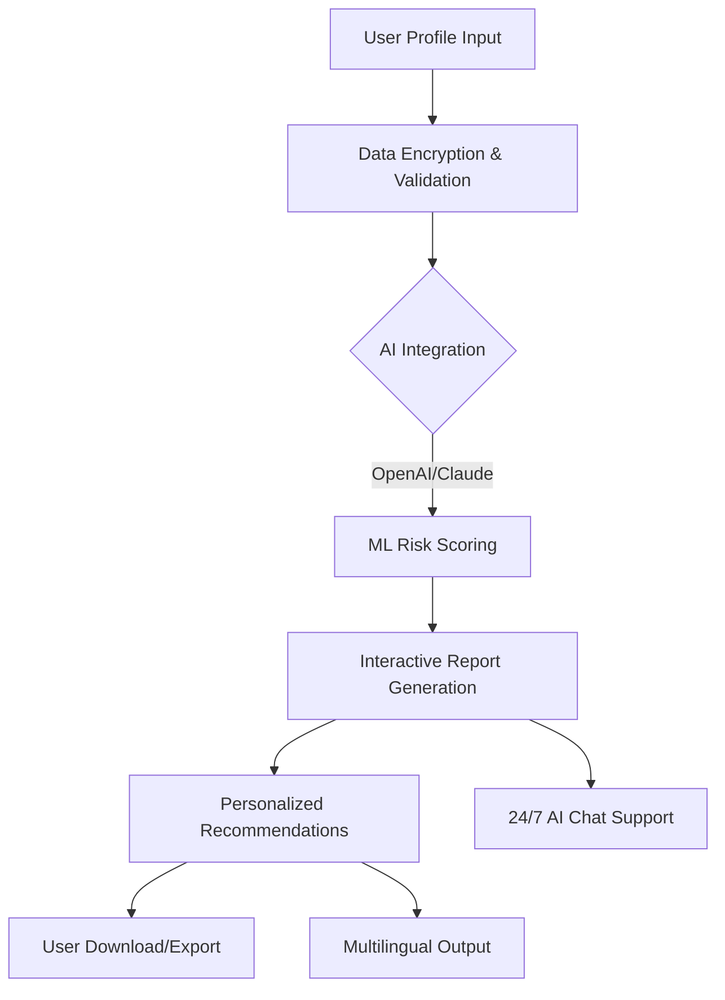

# CardioCare AI: Advanced Heart Health Risk Dashboard

## Overview

Welcome to **CardioCare AI**, where innovation meets empathy in proactive heart health. This intelligent web platform orchestrates the latest advances in artificial intelligence, predictive analytics, and conversational interfaces to empower users with nuanced heart-disease risk assessment.

With a focus on accessibility and engagement, CardioCare AI seamlessly fuses real-time health scoring, multilingual guidance, and human-like API-driven support, marking a new paradigm in personal healthcare technology. The dashboard not only provides immediate cardiovascular insights based on medical and lifestyle data, but also recommends actionable next steps, fostering wellness journeys in a secure, ethical, and user-centric environment.

---

## 🔗 Download & Installation

To experience CardioCare AI, download the full platform suite and quick-start resources:

---

## 🚀 Feature List

- **AI-Powered Risk Analytics**  
  Harnesses machine learning (supporting both OpenAI and Claude APIs) to analyze up-to-date medical patterns.

- **Dynamic Profile Management**  
  Users can create and update health profiles, enriching personal risk predictions over time.

- **Responsive, Mobile-First UI**  
  Optimized for desktop, tablet, and smartphone—engage wherever you go.

- **Multilingual & Inclusive**  
  Interface and AI chatbot support 10+ languages, making bench-to-bedside healthcare accessible globally.

- **Cloud-Secured Data Storage**  
  State-of-the-art encryption; user consent governs all data flows.

- **Continuous 24/7 Conversational Support**  
  AI assistants trained on healthcare FAQs and custom datasets (not a replacement for medical advice).

- **Deep Analytics Dashboard**  
  Visualizes health trajectories with graphs, trends, and interactive widgets.

- **Custom Report Downloads**  
  Single-click export of risk reports for you or your doctor.

- **Open-Source Energized**  
  MIT-licensed, customizable; extensible by the global dev community.

- **SEO-Optimized Documentation**  
  Deep, searchable help indexed for efficient knowledge access.

---

## 🌍 Example Use Case: Profile Configuration

Unlock personalized experiences by configuring your health profile:

**`profile_config.yaml`**

name: "Samira Beltran"  
age: 51  
gender: "female"  
blood_pressure: 128  
cholesterol: 203  
smoker: false  
diabetes: true  
exercise_freq_per_week: 2  
preferred_language: "Spanish"

This profile enhances predictive relevance and tailors language preferences throughout the platform.

---

## 💻 Example Console Invocation

Launching the CardioCare AI assessment in your terminal is simple:

cardiocare assess --profile ./profile_config.yaml --interactive

- Use `--interactive` for live Q&A.
- Language auto-detects from your config.

---

## 🗺️ OS Compatibility Table

| OS         | Supported | Notes |
|------------|:---------:|-------|
| 🪟 Windows  |    ✔️    | Edge & Chrome fully tested |
| 🍏 macOS    |    ✔️    | Safari optimized |
| 🐧 Linux    |    ✔️    | Support via Chromium browsers |
| 📱 Android  |    ✔️    | Recommended latest 2 versions |
| 🍏 iOS      |    ✔️    | Multilingual UI automatic |

---

## 📝 Example SEO Keywords

- heart disease risk assessment online
- AI-powered cardiovascular health dashboard
- instant heart health prediction
- multilingual heart risk web platform
- real-time medical analytics platform

---

## 🗣️ Multilingual Support

CardioCare AI welcomes users in:

- English
- Spanish
- Portuguese
- French
- Hindi
- Mandarin Chinese
- Arabic
- Russian
- Bengali
- German
*+more on request!*

Language preferences are honored in risk reports and chat support, making each interaction comfortable and accessible.

---

## 🧠 OpenAI & Claude API Integration

- **Predictive Models**: Core assessment utilizes OpenAI’s GPT and Claude for interpreting risk features, generating explanations, and maintaining chat interface fluency.
- **Conversational Guides**: Advanced topics, FAQs, and empathy-driven suggestions powered by the latest AI APIs.
- **Third-Party Expansion**: APIs can be swapped or updated for custom integrations (see `/integrations` folder documentation).

---

## ✨ Key Features

### 🔥 Responsive UI

Adaptive layouts and color themes for day/night health-tracking experiences.

### 🌐 Multilingual Intelligence

Internationalization modules ensure risk reports, guidance, and chat are delivered in your preferred language with cultural sensitivity.

### ☎️ 24/7 AI Customer Support

Rely on smart, always-available chatbots for fast answers, peace of mind, and warm guidance—even at 2AM.

---

## 🛡️ Disclaimer

**CardioCare AI does not provide diagnosis or prescriptive advice. The platform is designed to supplement user awareness and support conversations with real healthcare professionals. Always consult a licensed practitioner for medical questions. Usage is subject to the full license terms.**

---

## 🎨 Mermaid Diagram: Heart Risk Prediction Flow

---

## 📜 License

This project is licensed under the [MIT License](https://opensource.org/licenses/MIT).

© 2026 CardioCare AI. All rights reserved.

---

## 🌟 Download Again

To access the CardioCare AI dashboard, download the toolkit here:

---

Join us on a journey where data empathy illuminates the path to a healthier heart. Nourish your curiosity—shape the future of AI-powered wellness!